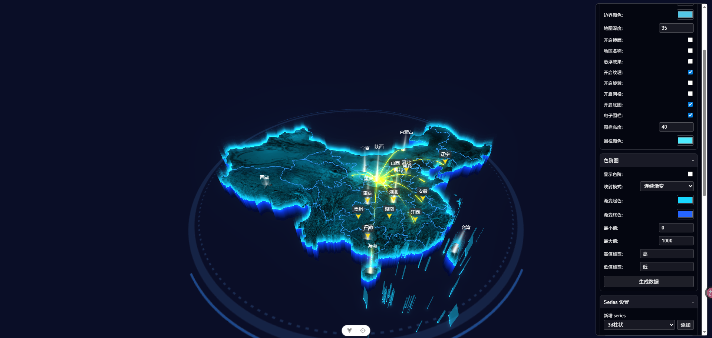

# ThreeMap

一个基于 **Three.js + Vue 3** 的 3D 地理可视化组件，支持行政区域拉伸、多种数据图层叠加、辉光后处理、下钻交互等功能。

[](https://vuejs.org/)
[](https://threejs.org/)
[](https://www.typescriptlang.org/)
[](https://vitejs.dev/)
[](./LICENSE)

---

## 目录

- [ThreeMap](#threemap)
  - [目录](#目录)
  - [功能特性](#功能特性)
  - [预览](#预览)
  - [快速开始](#快速开始)
    - [环境要求](#环境要求)
    - [安装依赖](#安装依赖)
    - [启动开发服务器](#启动开发服务器)
    - [构建生产包](#构建生产包)
  - [组件使用](#组件使用)
  - [配置项（Options）详解](#配置项options详解)
    - [config — 地图基础配置](#config--地图基础配置)
    - [camera — 相机位置](#camera--相机位置)
    - [itemStyle — 区域样式](#itemstyle--区域样式)
    - [label — 区域标注](#label--区域标注)
    - [tooltip — 提示框](#tooltip--提示框)
    - [glow — 辉光后处理](#glow--辉光后处理)
    - [grid — 网格](#grid--网格)
    - [foundation — 底图装饰](#foundation--底图装饰)
    - [mirror — 镜面反射](#mirror--镜面反射)
    - [wall — 电子围栏](#wall--电子围栏)
    - [texture — 地图贴图](#texture--地图贴图)
    - [autoRotate — 自动旋转](#autorotate--自动旋转)
    - [emphasis — 高亮样式](#emphasis--高亮样式)
    - [lineStyle / outLineStyle — 边线](#linestyle--outlinestyle--边线)
  - [数据（data）格式](#数据data格式)
  - [Series 图层](#series-图层)
    - [marker — 标记点](#marker--标记点)
    - [scatter — 扩散点](#scatter--扩散点)
    - [prism — 棱柱](#prism--棱柱)
    - [cylinder — 圆柱](#cylinder--圆柱)
    - [flight — 飞线](#flight--飞线)
  - [事件 API](#事件-api)
  - [地图注册与下钻](#地图注册与下钻)
  - [目录结构](#目录结构)
  - [开发指南](#开发指南)
    - [推荐 IDE](#推荐-ide)
    - [代码格式化](#代码格式化)
    - [新增图层](#新增图层)
  - [依赖说明](#依赖说明)
  - [浏览器兼容](#浏览器兼容)
  - [License](#license)

---

## 功能特性

| 功能               | 说明                                            |
| ------------------ | ----------------------------------------------- |
| 🗺️ 3D 地图拉伸     | GeoJSON 驱动，顶面/侧面独立配色，可添加贴图纹理 |
| 🌟 辉光后处理      | UnrealBloom 选择性辉光，仅对指定对象生效        |
| 📊 数据可视化映射  | 连续渐变色阶 / 分段规则两种模式                 |
| 📍 Marker 图层     | 自定义 SVG/图片标记，支持自定义大小与偏移       |
| 💫 Scatter 扩散点  | 带呼吸动画的扩散圆环散点图                      |
| 🔵 Cylinder 柱状图 | 渐变圆柱或发光塔模式，支持高度比例映射          |
| 🔺 Prism 棱柱图    | 三角/四角/六角棱柱，支持渐变色                  |
| ✈️ Flight 飞线     | 弧线飞线动画，多色头部粒子效果                  |
| 🔍 下钻交互        | 双击省份/城市可钻入下一级，支持返回             |
| 💡 Tooltip         | 自定义 HTML 模板提示框，hover/click 触发        |
| 🪟 镜面反射        | 可选虚拟镜面水面效果                            |
| 🔲 底图装饰        | 可旋转/静态纹理底盘                             |
| 📐 自适应缩放      | ResizeObserver 自动响应容器尺寸变化             |

---

## 预览




> 3D 拉伸地图 + 辉光边界 + Marker/飞线/柱状图层 + 可视化控制面板

---

## 快速开始

### 环境要求

- Node.js `^20.19.0` 或 `>=22.12.0`
- 现代浏览器（支持 WebGL 2）

### 安装依赖

```sh
npm install
```

### 启动开发服务器

```sh
npm run dev
```

### 构建生产包

```sh
npm run build
```

---

## 组件使用

```vue
<template>
  <ThreeMap
    style="width: 100%; height: 600px"
    :options="options"
    @click="onDistrictClick"
    @dblclick="onDistrictDblClick"
  />
</template>

<script setup lang="ts">
import ThreeMap from '@/components/ThreeMap/index.vue'
import { createDefaultOptions } from '@/components/ThreeMap/options/threeOption'
import { ref, onMounted } from 'vue'

const options = ref(createDefaultOptions())

// 注册中国地图（adcode: '100000'）
// 注册在组件内部 onMounted 中自动完成，也可以通过 mapCode prop 控制

function onDistrictClick(data: any) {
  console.log('clicked district:', data.name, data.adcode)
}

function onDistrictDblClick(data: any) {
  // 双击自动下钻到下一级地图
  console.log('drill into:', data.name)
}
</script>
```

> `ThreeMap/index.vue` 内置了地图注册、下钻交互、控制面板与视觉映射条，开箱即用。

---

## 配置项（Options）详解

所有配置通过 `ThreeMapOptions` 对象传入，可用 `createDefaultOptions()` 获取默认值后按需覆盖。

```ts
import { createDefaultOptions } from '@/components/ThreeMap/options/threeOption'
const options = createDefaultOptions()
```

---

### config — 地图基础配置

```ts
config: {
  autoScale: true,        // 是否根据容器尺寸自动计算地图缩放比例
  autoScaleFactor: 1,     // autoScale 的缩放倍率微调
  scale: 100,             // autoScale=false 时的手动比例
  depth: 35,              // 地图拉伸厚度（Three.js 单位）
  disableRotate: false,   // 禁用轨道旋转
  disableZoom: false,     // 禁用缩放
}
```

---

### camera — 相机位置

```ts
camera: {
  x: 0.8,   // 初始相机 X 坐标
  y: 6,     // 初始相机 Y 坐标（高度）
  z: 3,     // 初始相机 Z 坐标（前后）
}
```

---

### itemStyle — 区域样式

```ts
itemStyle: {
  topColor:  '#0d2a4b',   // 区域顶面颜色
  sideColor: '#0d2d6e',   // 区域侧面颜色
  uColor:    '#0d2a4b',   // 法线贴图混合色

  range: {
    show: false,           // 是否启用数据颜色映射
    mode: 'range',         // 'range' 连续渐变 | 'separate' 分段规则

    // mode='range' 时：按 [min, max] 在两色之间插值
    color: ['#1A3A6B', '#00FFFF'],
    min: 0,
    max: 100,
    visualMap: {
      show: true,
      maxText: '高',
      minText: '低',
      left: '20px',
      top: '50%',
      textStyle: { fontSize: 12, color: '#fff', ... }
    },

    // mode='separate' 时：按 value 阈值匹配规则
    rules: [
      { value: 0,  color: '#1A3A6B', label: '低' },
      { value: 50, color: '#00BFFF', label: '中' },
      { value: 80, color: '#00FFFF', label: '高' },
    ],
  }
}
```

**数据映射逻辑：**

- `mode: 'range'`：`value` 在 `[min, max]` 间线性插值，从 `color[0]` 渐变到 `color[1]`。
- `mode: 'separate'`：从 `rules` 数组中找到 `value >= rule.value` 的最后一条规则取色。

---

### label — 区域标注

```ts
label: {
  show: true,
  name: '',                   // 固定文本（空时显示 feature.properties.name）
  isFormatter: false,         // 是否使用自定义 formatter
  formatter: null,            // (data) => string，返回 HTML 字符串
  formatterHtml: '',          // 静态 HTML 字符串（不含动态数据）
  className: '',              // 额外 CSS 类名
  offset: [0, 0],             // [水平, 垂直] 偏移（像素）
  itemStyle: {
    padding: [2, 6, 2, 6],
    backgroundColor: 'rgba(0,0,0,0)',
    borderRadius: 4,
    borderColor: 'transparent',
    borderWidth: 0,
    textStyle: {
      fontSize: 12,
      color: '#DFF6FF',
      fontWeight: 'normal',
      ...
    }
  }
}
```

---

### tooltip — 提示框

```ts
tooltip: {
  show: true,
  isFormatter: false,
  formatter: (data) => `<span>${data.name}：${data.value}</span>`,
  formatterHtml: '',       // 静态 HTML 优先级高于 formatter
  itemStyle: {
    backgroundColor: 'rgba(8,20,45,0.82)',
    borderColor: 'rgba(72,204,255,0.45)',
    borderWidth: 0,
    borderStyle: 'solid',
    borderRadius: 5,
    padding: [10, 10, 10, 10],
    color: '#DFF6FF',
    fontSize: 14,
    minWidth: 80,
    width: 'max-content',
  }
}
```

---

### glow — 辉光后处理

```ts
glow: {
  show: true,        // 是否启用 UnrealBloom 辉光
  threshold: 0,      // 亮度阈值（0~1）
  strength: 1,       // 辉光强度
  radius: 0,         // 辉光扩散半径
}
```

> 辉光仅对标记了 `_isGlow = true` 的对象生效（包括区域边界、电子围栏等），通过双 Composer + 场景遍历实现选择性辉光。

---

### grid — 网格

```ts
grid: {
  show: false,
  color: '#2BD9FF',
  opacity: 0.2,
}
```

---

### foundation — 底图装饰

```ts
foundation: {
  show: false,
  size: 800,           // 底盘尺寸
  speed: 0.5,          // 旋转速度（isRotate=true 时）
  image: 'default',    // 贴图路径，'default' 使用内置图片
  isRotate: true,      // 是否旋转
  static: false,       // true 时静止显示
}
```

---

### mirror — 镜面反射

```ts
mirror: {
  show: false,
  color: ['#020B1F', '#00D2FF'],   // 渐变底色 [顶色, 底色]
}
```

---

### wall — 电子围栏

```ts
wall: {
  show: false,
  height: 40,           // 围栏高度
  color: '#4DEBFF',     // 围栏颜色
}
```

---

### texture — 地图贴图

```ts
texture: {
  show: true,
  autoRepeat: false,              // 自动计算重复次数
  repeat: { x: 0.0927, y: 0.124 },
  offset: { x: 0.5918, y: 0.324 },
  image: 'default',               // 贴图 URL 或 'default'
}
```

---

### autoRotate — 自动旋转

```ts
autoRotate: {
  autoRotate: false,
  autoRotateSpeed: 2,    // 旋转速度（度/秒）
}
```

---

### emphasis — 高亮样式

```ts
emphasis: {
  show: true,
  topColor: '#1E90FF',     // hover 时顶面颜色
  textStyle: { fontSize: 14, color: '#fff', fontWeight: 'bold', ... }
}
```

---

### lineStyle / outLineStyle — 边线

```ts
lineStyle: {
  color: '#2BD9FF',      // 省级边界线颜色（辉光对象）
}
outLineStyle: {
  color: '#2BD9FF',      // 轮廓线颜色
}
```

---

## 数据（data）格式

`data` 是顶层地图区域的数据数组，用于颜色映射和 tooltip 显示。

```ts
data: [
  {
    district: '110000', // 行政区 adcode（字符串/数字）或 [lng, lat] 坐标
    name: '北京市', // 可选，覆盖 GeoJSON 中的名称
    value: 85, // 数值（用于色阶映射和 tooltip）
    color: null, // 可选，直接指定该区域颜色（优先级最高）
  },
  // ...
]
```

| 字段       | 类型                             | 说明                          |
| ---------- | -------------------------------- | ----------------------------- |
| `district` | `string \| number \| [lng, lat]` | 行政区 adcode 或经纬度坐标    |
| `name`     | `string`                         | 区域名称                      |
| `value`    | `number`                         | 数值，参与色阶映射            |
| `color`    | `string \| null`                 | 直接指定颜色，覆盖 range 映射 |

---

## Series 图层

通过 `series` 数组添加多个图层，每个图层有独立的 `type` 和配置。

```ts
series: [
  { type: 'marker', ... },
  { type: 'scatter', ... },
  { type: 'cylinder', ... },
]
```

---

### marker — 标记点

在指定区域或坐标上放置自定义图标。

```ts
{
  type: 'marker',
  seriesName: '城市标记',
  symbol: '',                         // SVG 字符串或图片 URL
  symbolSize: [30, 30],               // [宽, 高]（像素）
  symbolSizeFormatter: null,          // (data) => [w, h]，动态尺寸
  offset: [0, 0],                     // 偏移量（像素）
  className: '',
  label: { ... },                     // 参见 label 配置
  data: [
    { district: '110000', name: '北京', value: 100 },
    { district: [116.4, 39.9], name: '自定义坐标' },
  ]
}
```

---

### scatter — 扩散点

带呼吸环动画的散点图层。

```ts
{
  type: 'scatter',
  seriesName: '热点',
  spotColor: '#00FFFF',      // 中心点颜色
  spotSize: 0.06,            // 中心点半径（Three.js 单位）
  spotSizeFormatter: null,   // (data) => size，动态大小
  spotSeparate: 0,           // 中心点与地图表面的间距
  ringColor: '#00FFFF',      // 扩散环颜色
  ringRatio: 3,              // 扩散环最大半径倍率
  ringSeparate: 0,           // 扩散环间距
  offset: [0, 0],
  label: { ... },
  data: [...]
}
```

---

### prism — 棱柱

按 `value` 比例映射高度的棱柱图层。

```ts
{
  type: 'prism',
  seriesName: '棱柱图',
  prismType: 3,              // 3=三棱柱 | 4=四棱柱（方形） | 6=六棱柱
  size: 0.15,                // 棱柱底面半径
  maxHeight: 3,              // 最大高度（Three.js 单位）
  minHeight: 0.3,            // 最小高度
  offset: [0, 0],
  className: '',
  label: { ... },
  itemStyle: {
    color: ['#00BFFF', '#00FFFF', '#ffffff'],  // [底色, 顶色, 高亮色]
  },
  data: [...]
}
```

---

### cylinder — 圆柱

渐变色柱状图或发光塔。

```ts
{
  type: 'cylinder',
  seriesName: '柱状图',
  mode: 'cylinder',          // 'cylinder' 渐变柱 | 'tower' 发光塔
  color: ['#00BFFF', '#00FFFF'],  // [底色, 顶色]（cylinder 模式）
  towerColor: '#00FFFF',     // tower 模式颜色
  size: 0.1,                 // 底面半径
  maxHeight: 3,
  minHeight: 0.3,
  separate: 0,               // 柱底与地面的间距
  offset: [0, 0],
  label: { ... },
  data: [...]
}
```

---

### flight — 飞线

两点之间的弧线动画。

```ts
{
  type: 'flight',
  seriesName: '飞线',
  points: 50,                // 飞线粒子数量
  flightLen: 0.2,            // 飞线头部长度比例（0~1）
  speed: 0.003,              // 移动速度
  flightColor: ['#00FFFF', '#0080FF', '#00BFFF'],  // 渐变色数组
  headSize: 0.04,            // 头部粒子大小
  data: [
    { start: '110000', end: '310000' },          // adcode
    { start: [116.4, 39.9], end: [121.5, 31.2] } // 经纬度
  ]
}
```

---

## 事件 API

通过 `ThreeMap` 类的 `on()` / `off()` 方法注册事件（组件内部已封装为 Vue emit）：

| 事件       | 触发时机             | 回调参数                       |
| ---------- | -------------------- | ------------------------------ |
| `click`    | 点击区域/散点/柱体   | `{ name, adcode, value, ... }` |
| `dblclick` | 双击区域（触发下钻） | `{ name, adcode, value, ... }` |
| `change`   | 相机位置改变         | `THREE.Camera` 实例            |

```ts
// 直接使用 ThreeMap 类
const map = new ThreeMap(containerEl, tooltipEl)
map.on('click', (data) => {
  console.log(data.name, data.adcode)
})
map.on('dblclick', (data) => {
  // 手动实现下钻
})
map.off('click') // 移除 click 监听
map.off() // 移除所有监听
```

---

## 地图注册与下钻

```ts
// 注册地图（返回完整 GeoJSON FeatureCollection）
const mapJson = await map.registerMap(
  '100000', // GeoJSON 文件 adcode
  '100000', // 注册名（用于 options.map 引用）
  options.config, // MapConfig
)

// 切换地图后调用 setOption 渲染
map.setOption({
  ...options,
  map: '100000',
})
```

内置的 GeoJSON 文件位于 `src/assets/geoJson/`，以省级 adcode 命名（如 `110000.json` = 北京）。`100000.json` 为中国全图，`100000_bound.json` 为国界边界。

---

## 目录结构

```
src/
├── assets/
│   ├── geoJson/              # 全国省市 GeoJSON 文件
│   │   ├── 100000.json       # 中国全图
│   │   ├── 100000_bound.json # 国界边界
│   │   ├── 110000.json       # 北京
│   │   └── ...               # 其他省份
│   └── images/               # 内置纹理图片
│
└── components/ThreeMap/
    ├── index.vue             # Vue 组件入口（含面板、视觉映射、下钻）
    ├── ThreeMap.ts           # 核心类（场景管理、渲染循环、事件系统）
    ├── ControlPanel.vue      # 可视化控制面板
    ├── types.ts              # 全量 TypeScript 类型定义
    │
    ├── options/              # 默认配置工厂
    │   ├── threeOption.ts    # createDefaultOptions()
    │   ├── createLabel.ts
    │   ├── createMarker.ts
    │   ├── createPrism.ts
    │   ├── createCylinder.ts
    │   ├── createFlight.ts
    │   └── createScatter.ts
    │
    └── utils/                # 渲染工具函数
        ├── drawDistrict.ts   # 行政区拉伸 + 贴图 + 标注
        ├── drawOutLine.ts    # 边界线 + 电子围栏
        ├── drawGlow.ts       # UnrealBloom 辉光后处理
        ├── drawPlane.ts      # 镜面 / 渐变底板
        ├── drawGrid.ts       # 网格
        ├── drawFoundation.ts # 底图装饰
        ├── drawMarker.ts     # Marker 图层
        ├── drawScatter.ts    # Scatter 散点图层
        ├── drawPrism.ts      # Prism 棱柱图层
        ├── drawCylinder.ts   # Cylinder 圆柱图层
        ├── drawFlight.ts     # Flight 飞线图层
        ├── drawLabel.ts      # CSS2D 标注渲染
        ├── addTooltip.ts     # Tooltip 逻辑
        ├── helpers.ts        # 通用工具函数
        └── register.ts       # GeoJSON 加载 + 边界计算
```

---

## 开发指南

### 推荐 IDE

[VS Code](https://code.visualstudio.com/) + [Vue - Official](https://marketplace.visualstudio.com/items?itemName=Vue.volar) 扩展（禁用 Vetur）。

### 代码格式化

```sh
npm run format   # 使用 oxfmt 格式化 src/ 目录
```

### 新增图层

1. 在 `utils/` 新建 `drawXxx.ts`，导出形如 `drawXxx(this: ThreeMapContext, options, config)` 的函数。
2. 在 `options/` 新建 `createXxx.ts`，返回对应类型的默认配置。
3. 在 `types.ts` 补充 `XxxSeriesOptions` 接口并加入 `SeriesOptions` 联合类型。
4. 在 `ThreeMap.ts` 的 `setOption()` 的 switch 分支中注册新类型。

---

## 依赖说明

| 依赖         | 版本   | 用途                           |
| ------------ | ------ | ------------------------------ |
| `three`      | ^0.183 | 3D 渲染引擎                    |
| `d3-geo`     | ^3.1   | 地理投影（墨卡托）             |
| `@turf/turf` | ^7.3   | GeoJSON 边界计算（union/bbox） |
| `tinycolor2` | ^1.6   | 颜色解析与转换                 |
| `vue`        | ^3.5   | UI 框架                        |

---

## 浏览器兼容

| 浏览器        | 最低版本 |
| ------------- | -------- |
| Chrome / Edge | 90+      |
| Firefox       | 90+      |
| Safari        | 15+      |

> 需要 WebGL 2 支持。不支持 IE。

---

## License

[MIT](./LICENSE)
